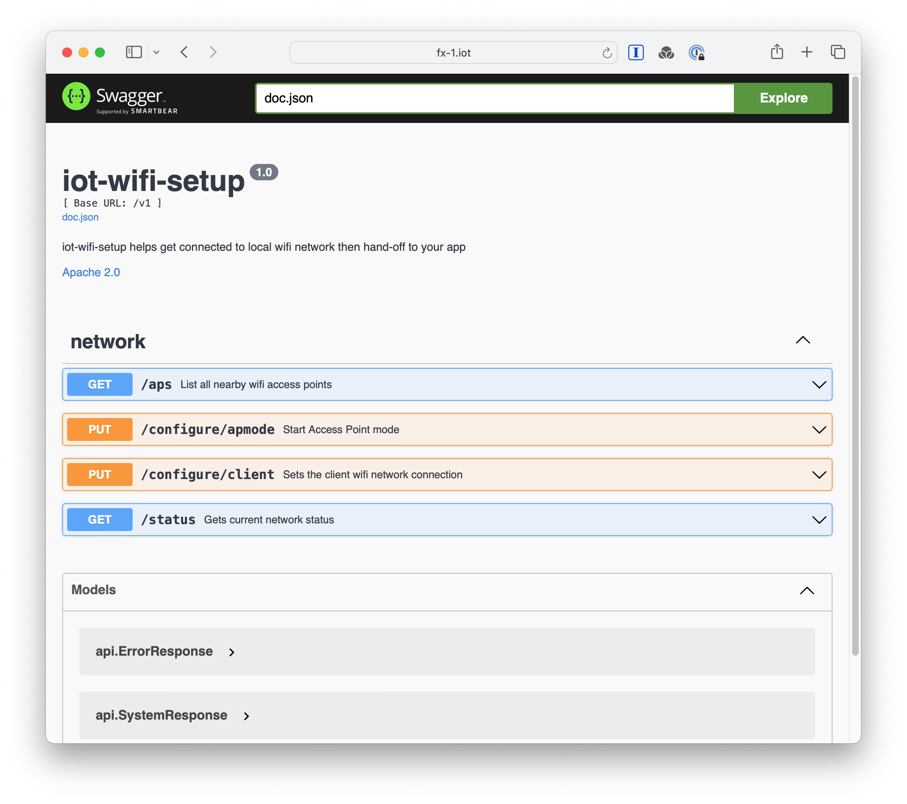
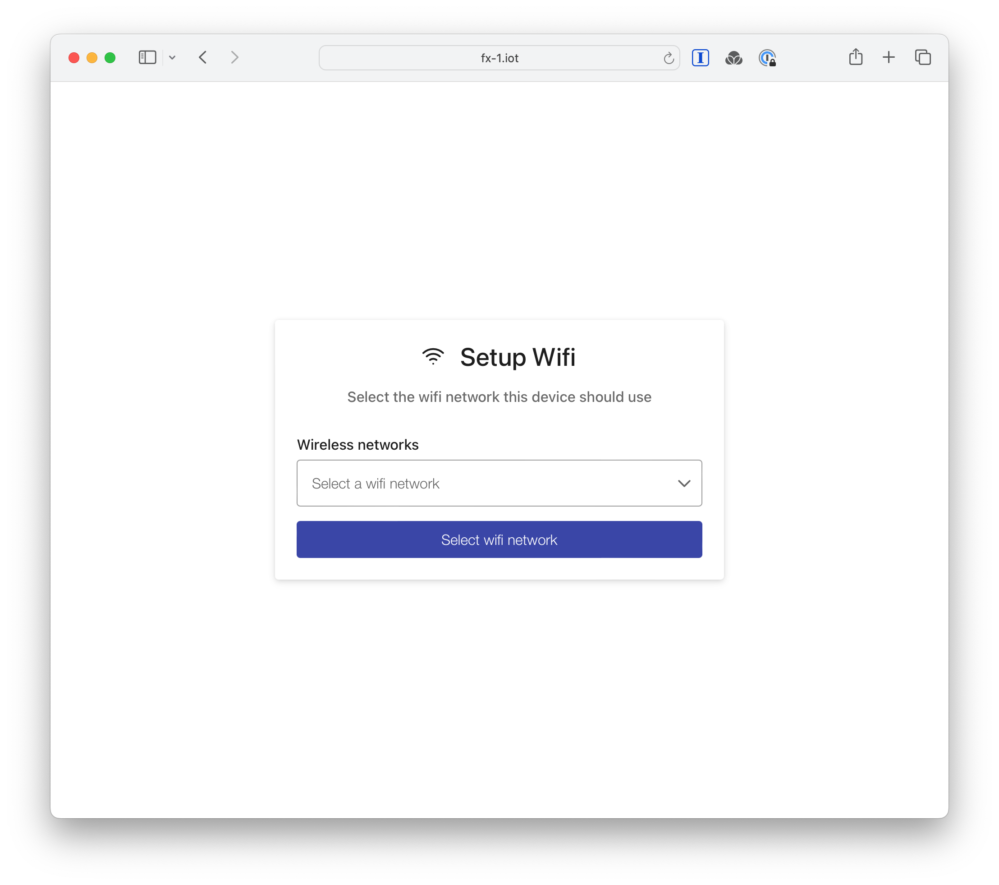

# iot-wifi-setup [](https://github.com/danesparza/iot-wifi-setup/actions/workflows/release.yaml)
Present a wifi AP to get connected to local wifi network and then hand-off to your app.  This uses [Network Manager](https://www.networkmanager.dev/) (available in newer versions of [Raspberry Pi OS](https://www.raspberrypi.com/software/) and Linux.  Bookworm and beyond)

## Installation
### Prerequisites
Install Raspberry Pi OS.  For best results, use the [Raspberry Pi imager](https://www.raspberrypi.com/software/) 
and pick 'Raspberry Pi OS (other)' and then 'Raspberry Pi OS Lite (64-bit)'.

Install the package repo (you only need to do this once per machine)
```
wget https://packages.cagedtornado.com/prereq.sh -O - | sh
```

### Package installation
Install the package
```
sudo apt install iot-wifi-setup
```

## Using 
Access the service using port `3070` by default.  

There is both an API for iot-wifi-setup so you can integrate with various app types (documentation: `http://<yourmachine>:3070/swagger`)


and a simple web based UI located at `http://<yourmachine>:3070/`

